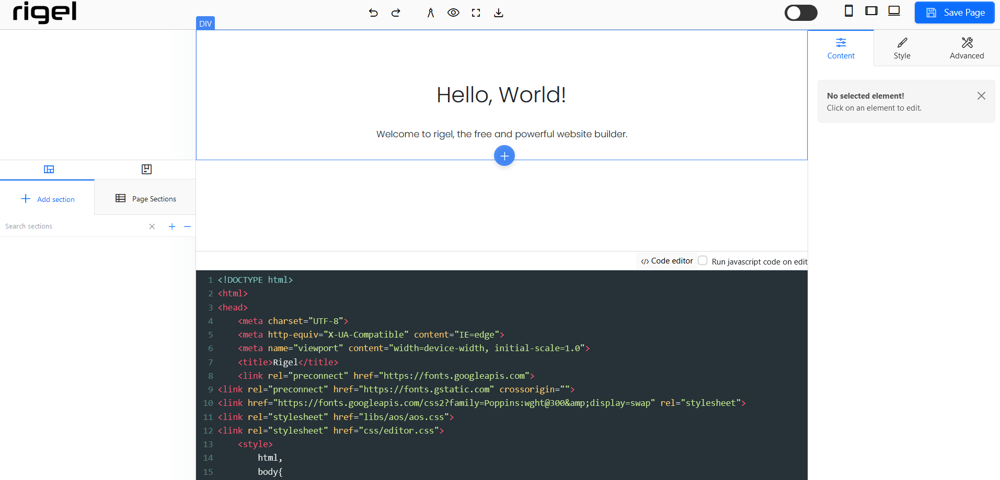
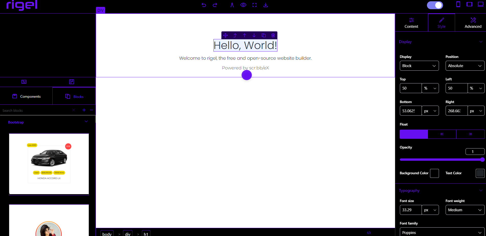
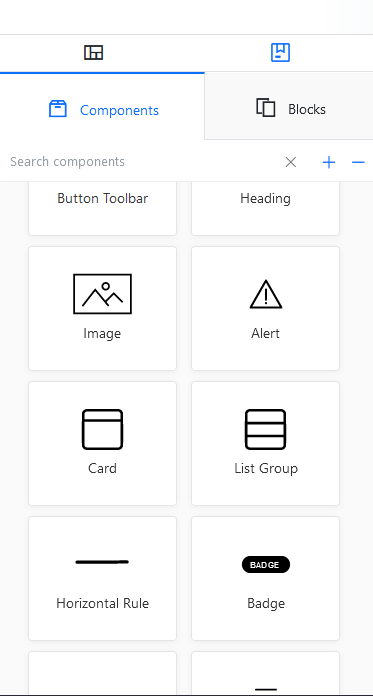

# The most powerful and advanced open-source web builder. Rigel.

[Rigel](https://rigel.scribblex.net) is the most advanced open source website builder. Rigel helps users in building web pages with all the functionalities of a website builder, but also provides a built-in code editor to make changes in live-time to the code and view the results.

[Rigel has successfully been tested for development of web pages and structure them in a human-like manner to make them easily editable.](https://rigel.scribblex.net/editor)

You can make web pages using the drag and drop functionalities, use a professional style editor to edit the style properties of any element, and use the built-in code editor to make changes to your web page.

### All the functionalities when broght together, provides complete freedom to the user to design and develop the webpage the way they want.

## What is a website builder?

A website builder is a programme or tool that allows you to design and create websites without having to edit any code. You can do everything you need to by yourself, without needing a designer or developer. With the specially developed drag-and-drop website builder software, you can simply choose from a vast range of templates and customise them in line with your brand vision!

## How does a website builder work?

Both online and offline website builders exist. Offline website builders need to be installed first before you can start using them. Online website builders are used in a web application, so there’s no need to install any software.

Online website builders are developed to be easy to use, for both beginners and more experienced designers.

The way a website builder actually works is simple. You start by choosing a template, which defines the look and feel of your website. Next, you simply use a drag-and-drop editor to build your website by editing the template, adding content and creating new pages. Drag-and-drop means literally dragging and dropping components and content into your workspace. You can add headings, texts, images, videos, and many other components. What you see is exactly how your website will appear when it goes live. Our Website Builder gives you a selection of over 140 fully customisable templates. You can easily customise the menu, divide content into columns and change pretty much anything you like!

---
## The only limit a user can have is his/her own imagination.
## Demo

To test Rigel without downloading it, go to the link below.
https://rigel.scribblex.net/editor

Visit the home page here: https://rigel.scribblex.net

---
# Screenshots

Rigel: Open source web builder. (Lignt Mode)

Rigel: Open source web builder. (Dark Mode)

Pre-defined Elements.

Style Manager for the elements.

Style Manager to Support Element Styling without code.

---

# Installation

Download the source code of Rigel from the official github repositiory (https://github.com/scribbleX-SDA/rigel)
The source code will be downloaded as a zip file.

Extract the zip file, and run it on your desktop.

### NO NEED TO RUN A SERVER ON LOCALHOST, YOU CAN SIMPLY LAUNCH THE index.html FILE in rigel/editor DIRECTORY.
## Authors

- [@kstyagi.23](https://github.com/kstyagi23)
- [@kashan2000](https://github.com/kashan2000)
- [@scribbleX-SDA](https://github.com/scribbleX-SDA)
## Feedback

If you have any feedback, please reach out to us at feedback@rigel.scribblex.net

## Report Bugs

To report bugs, reach out to the ScribbleX Developers Team at report@slx4.tech
## Support

For support, email info@scribblex.net we will be happy to help.
## License

[MIT](https://choosealicense.com/licenses/mit/)

